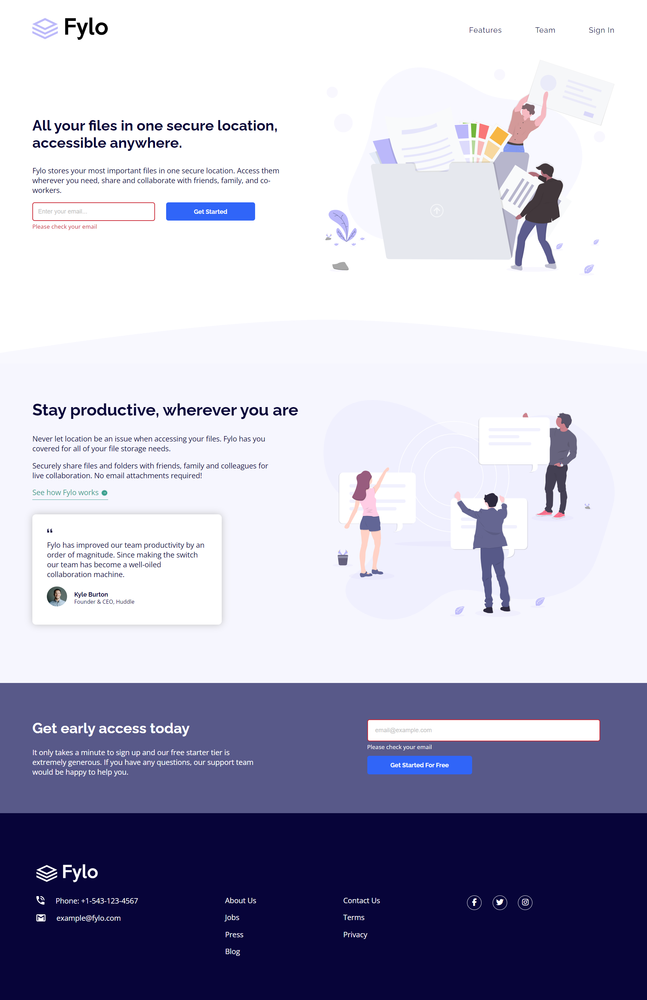

# Frontend Mentor - Fylo landing page with two column layout solution

This is a solution to the [Fylo landing page with two column layout challenge on Frontend Mentor](https://www.frontendmentor.io/challenges/fylo-landing-page-with-two-column-layout-5ca5ef041e82137ec91a50f5). Frontend Mentor challenges help you improve your coding skills by building realistic projects. 

## Table of contents

- [Overview](#overview)
  - [The challenge](#the-challenge)
  - [Screenshot](#screenshot)
  - [Links](#links)
- [My process](#my-process)
  - [Built with](#built-with)
  - [Useful resources](#useful-resources)
- [Author](#author)

## Overview

### The challenge

Users should be able to:

- View the optimal layout for the site depending on their device's screen size
- See hover states for all interactive elements on the page

### Screenshot

### Links

- Solution URL: [Fylo Landing Page Solution](https://www.frontendmentor.io/solutions/fylo-landing-page-with-two-column-layout-RlKoEIVIrO)
- Live Site URL: [Fylo Landing Page Live Site](https://mjspitta.github.io/fylo-landing-page-with-two-column-layout/)

## My process

### Built with

- Semantic HTML5 markup
- CSS custom properties
- Flexbox

### Useful resources

- [Styling Form Validation Errors](https://www.youtube.com/watch?v=6NdWrZ77YO4&t=393s) - This helped me style form validation errors around the email input field. 

## Author

- Frontend Mentor - [@MJspitta](https://www.frontendmentor.io/profile/MJspitta)
